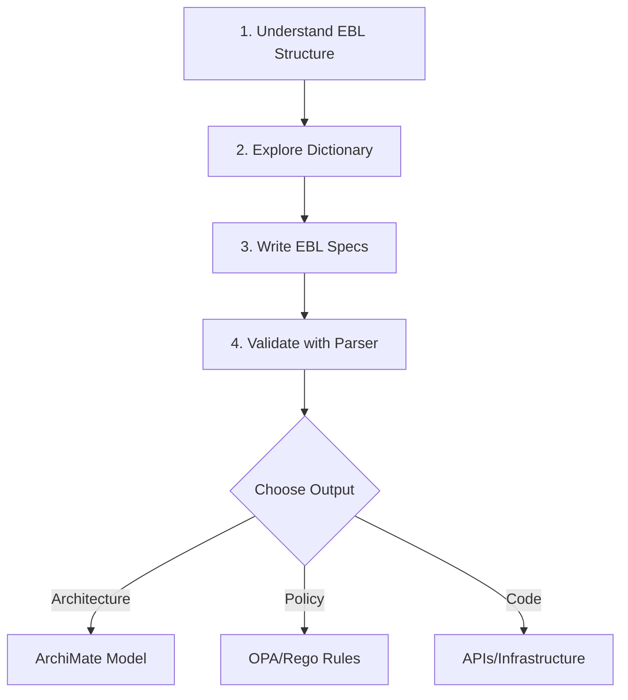
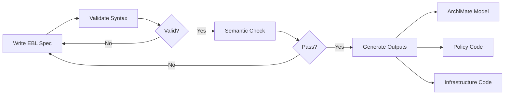

# **Getting Started with EBL (Enterprise Business Language)**
## *Build Business-Driven, Validated, Compilable Requirements*

> **Goal**: Learn to write **Enterprise Business Language (EBL)** specifications using the **standardized business lexicon**, validate them with **ANTLR parsers**, and compile them into **architecture models, policies, and executable artifacts**.

---



---

## What is EBL?

**Enterprise Business Language (EBL)** is a domain-specific language that enables business analysts, architects, and developers to express business requirements in a structured, machine-readable format that is:

- ✅ **Human-readable**: Natural business language with clear semantics
- ✅ **Machine-verifiable**: Validated against grammar and domain dictionaries
- ✅ **Compilable**: Generates architecture models, policies, and code
- ✅ **Traceable**: Links requirements to data, processes, capabilities, and policies

**BimL (Business Intelligence Modelling Language)** is Praxibility's implementation of EBL, enabling seamless generation of ArchiMate models, policy bundles (OPA/Rego), and Architecture-as-Code artifacts.

---

## Quick Start: 5-Minute Setup

### Prerequisites

```bash
# Required
- Java JDK 11+ (for ANTLR and Java validators)
- Python 3.8+ (for Python validators)
- Maven 3.6+ or Gradle 7+ (for building)

# Verify installation
java -version
python3 --version
mvn -version
```

### Clone and Build

```bash
# Clone the repository
git clone https://github.com/Archailign/praxibility-ebl.git
cd praxibility-ebl

# Build with Maven
cd EBL_v0.85
mvn clean install

# Or build with Gradle
gradle build

# Generate ANTLR parsers
mvn antlr4:antlr4
```

### Validate Your First EBL File

```bash
# Install Python dependencies
pip install antlr4-python3-runtime pytest

# Validate an example
cd EBL_v0.85
python ebl_validator.py EBL_Dictionary_v0.85.json examples/KYC_Onboarding.ebl
```

✅ **Success!** You're now ready to explore EBL.

---

## 1. Understanding EBL Structure

EBL files define business requirements using these core constructs:

### Core Constructs

| Construct | Purpose | Example |
|-----------|---------|---------|
| **DataObject** | Define data schemas, policies, and resources | `DO_KYCApplication` |
| **Entity** | Business entities with properties and rules | `Application`, `Claim` |
| **Process** | Business workflows with actors and steps | `KYCOnboarding`, `ClaimLifecycle` |
| **Rule** | Business rules with triggers and actions | Fraud detection, approval rules |
| **ITAsset** | IT infrastructure (apps, systems, platforms) | CRM, Payment Gateway |
| **Relationship** | Connections between entities/assets | `depends_on`, `hosted_on` |
| **Report** | Reporting definitions with queries | Compliance reports |
| **Integration** | External system integrations | API integrations |

---

## 2. Exploring the Dictionary

The **Enterprise Business Lexicon** (`EBL_Dictionary_v0.85.json`) defines:

### Core Types

```json
{
  "core": {
    "types": ["UUID", "String", "Integer", "Currency", "Ratio",
              "Date", "Enum", "JSON", "Boolean"],
    "keywords": {
      "reserved": ["ON", "WHEN", "THEN", "SHALL", "MUST", "MUST NOT",
                   "WITHIN", "BEFORE", "AFTER", "BY", "UNTIL"]
    }
  }
}
```

### Domain Packs

EBL includes pre-built vocabularies for multiple industries:

```bash
# View available domains
cat EBL_v0.85/EBL_Dictionary_v0.85_all.json | jq '.domains | keys'

# Domains included:
# - adtech: Campaigns, audiences, bidding
# - healthcare: Trials, patients, protocols
# - insurance: Claims, policies, underwriting
# - kyc: Identity verification, compliance
# - payments: Transactions, screening, accounts
# - logistics: Tracking, warehouses, routes
# - retail: Inventory, orders, customers
# - it: Applications, systems, infrastructure
```

### Actors and Verbs

Each domain defines **actors** (roles) and **verbs** (actions):

```yaml
# Example from KYC domain
actors:
  - Customer
  - Registrar
  - KYCAnalyst
  - ComplianceOfficer

verbs:
  - Capture (write permission)
  - Verify (read permission)
  - Screen (read permission)
  - Approve (write permission)
```

---

## 3. Writing Your First EBL Specification

### Example: KYC Onboarding Process

Create a file `MyKYCProcess.ebl`:

```ebl
Metadata:
  Domain: kyc
  Owner: Compliance
  Version: 0.85

DataObject DO_KYCApplication {
  Schema:
    AppId: UUID, required, unique
    CustomerId: UUID, required
    Status: Enum, values=["Pending","InReview","Approved","Rejected"]

  Policies:
    - "KYC records retained 10 years"
    - "PII encrypted at rest"

  Resources:
    Input:  { Channel: API, Protocol: HTTPS,
              Endpoint: "https://kyc.example.com/app",
              Auth: OAuth2, Format: JSON, SLA: "P95<300ms" }
    Output: { Channel: API, Protocol: HTTPS,
              Endpoint: "https://kyc.example.com/app",
              Auth: OAuth2, Format: JSON, SLA: "P95<300ms" }

  erMap: KYCApp
}

Entity Application {
  dataRef: DO_KYCApplication
  Properties:
    AppId: { type: UUID, required: true, unique: true }
    Status: { type: Enum, values: ["Pending","InReview","Approved","Rejected"],
              default: "Pending" }
  erMap: Application
}

Process KYCOnboarding {
  Description: "Capture documents, verify identity, and approve"
  ObjectiveID: KYC1
  BusinessGoalID: AFC1
  Actors: [Customer, Registrar, KYCAnalyst, ComplianceOfficer]
  erMap: KYCOnboarding
  Starts With: Event ApplicationSubmitted(Application)

  Step CaptureDocs {
    Actions:
      - Registrar Capture via DO_KYCApplication Input
  }

  Step VerifyAndApprove {
    Validation:
      - Documents MUST be verified BEFORE approval
    Actions:
      - KYCAnalyst Verify via DO_KYCApplication Output
      - KYCAnalyst Screen via DO_KYCApplication Output
      - ComplianceOfficer Approve via DO_KYCApplication Input
  }

  Ends With: Event ApplicationApproved(Application)
}
```

### Example: Insurance Claim Lifecycle

Based on `examples/Insurance_ClaimLifecycle.ebl`:

```ebl
Metadata:
  Domain: insurance
  Owner: Claims
  Version: 0.85

DataObject DO_Claim {
  Schema:
    ClaimId: UUID, required, unique
    PolicyId: UUID, required
    Status: Enum, values=["Filed","Assessed","Approved","Rejected","Paid","Closed"]

  Policies:
    - "Claims retained 7 years"

  Resources:
    Input:  { Channel: API, Protocol: HTTPS,
              Endpoint: "https://ins.example.com/claim",
              Auth: OAuth2, Format: JSON, SLA: "P95<400ms" }
    Output: { Channel: API, Protocol: HTTPS,
              Endpoint: "https://ins.example.com/claim",
              Auth: OAuth2, Format: JSON, SLA: "P95<400ms" }

  erMap: Claim
}

Process ClaimLifecycle {
  Description: "Process an insurance claim end-to-end"
  ObjectiveID: INS1
  BusinessGoalID: CSAT1
  Actors: [Policyholder, ClaimsAdjuster, Underwriter, PaymentClerk]
  erMap: ClaimLifecycle
  Starts With: Event ClaimFiled(Claim)

  Step Assess {
    Validation:
      - Provide all documentation BEFORE approval
    Actions:
      - ClaimsAdjuster Assess via DO_Claim Output
      - Underwriter Approve via DO_Claim Input
  }

  Step Pay {
    Actions:
      - PaymentClerk Disburse via DO_ClaimPayment Input
  }

  Ends With: Event ClaimClosed(Claim)
}
```

---

## 4. Validating EBL Specifications

### Python Validator

```bash
# Validate a single file
cd EBL_v0.85
python ebl_validator.py EBL_Dictionary_v0.85.json examples/KYC_Onboarding.ebl

# Expected output:
# ✓ Parsing successful
# ✓ Semantic validation passed
# ✓ All actors defined in dictionary
# ✓ All verbs permitted by actors
# ✓ All relationships valid
```

### Java Validator

```bash
# Build and run Java validator
mvn clean package
java -cp target/classes:generated-src/java \
  org.example.ebl.EBLSemanticValidator \
  EBL_Dictionary_v0.85.json \
  examples/Insurance_ClaimLifecycle.ebl
```

### Run All Tests

```bash
# Maven
mvn test

# Gradle
gradle test

# Python tests
cd EBL_v0.85
PYTHONPATH=generated-src/python pytest -q
```

---

## 5. Understanding the Grammar

EBL uses **ANTLR4** for parsing. The grammar is defined in `EBL_v0.85/src/main/antlr4/EBL.g4`.

### Key Grammar Rules

```antlr
// Top-level structure
eblDefinition:
  metadata
  dataObject+
  entity+
  (itAsset | process | ruleDef | relationshipDef | report | integration)*
  EOF;

// DataObject definition
dataObject:
  'DataObject' IDENTIFIER '{' NL+
    'Schema' ':' NL+ fieldDef+
    'Policies' ':' NL+ policyDef+
    'Resources' ':' NL+ resourceBlock
    'erMap' ':' IDENTIFIER NL+
  '}';

// Process definition
process:
  'Process' IDENTIFIER '{' NL+
    'Description' ':' STRING NL+
    'ObjectiveID' ':' IDENTIFIER NL+
    'BusinessGoalID' ':' IDENTIFIER NL+
    'Actors' ':' '[' IDENTIFIER (',' IDENTIFIER)* ']' NL+
    'erMap' ':' IDENTIFIER NL+
    'Starts With' ':' event NL+
    step+
    'Ends With' ':' event NL+
  '}';

// Core types
type: 'UUID' | 'String' | 'Integer' | 'Currency' | 'Ratio' |
      'Date' | 'Enum' | 'JSON' | 'Boolean';
```

---

## 6. Generate Parsers for Different Languages

### Python Parser

```bash
# Download ANTLR
curl -LO https://www.antlr.org/download/antlr-4.13.1-complete.jar

# Generate Python parser
java -jar antlr-4.13.1-complete.jar \
  -Dlanguage=Python3 \
  -visitor -listener \
  -o generated-src/python \
  src/main/antlr4/EBL.g4

# Install runtime
pip install antlr4-python3-runtime
```

### Java Parser

```bash
# Generate Java parser
java -jar antlr-4.13.1-complete.jar \
  -Dlanguage=Java \
  -visitor -listener \
  -package org.example.ebl \
  -o generated-src/java \
  src/main/antlr4/EBL.g4
```

### Go Parser (Optional)

```bash
# Generate Go parser
java -jar antlr-4.13.1-complete.jar \
  -Dlanguage=Go \
  -visitor -listener \
  -o generated-src/go \
  src/main/antlr4/EBL.g4

# Install Go runtime
go get github.com/antlr/antlr4/runtime/Go/antlr/v4
```

---

## 7. Exploring Examples

EBL v0.85 includes **15+ real-world examples** across multiple domains:

### AdTech Examples
```bash
cat examples/AdCampaignManagement.ebl
cat examples/AdTech_Dynamic_Marketing_Cycle_Full.ebl
```

### Healthcare Examples
```bash
cat examples/Healthcare_PatientIntake.ebl
```

### Insurance Examples
```bash
cat examples/Insurance_ClaimLifecycle.ebl
cat examples/Insurance_Subrogation_Counterparty.ebl
```

### KYC/Compliance Examples
```bash
cat examples/KYC_Onboarding.ebl
cat examples/KYC_Verb_NeverPermitted.ebl  # Demonstrates validation warnings
```

### Payments Examples
```bash
cat examples/Payments_Screening.ebl
cat examples/AFC_Fraud_SAR.ebl
```

### IT Infrastructure Examples
```bash
cat examples/IT_Application_Onboarding.ebl
cat examples/IT_Topology_Relationships.ebl
```

### Logistics Examples
```bash
cat examples/Logistics_Tracking.ebl
```

---

## 8. Validation Features

EBL validators perform comprehensive checks:

### ✅ Grammar Validation
- Valid syntax according to ANTLR grammar
- Proper construct definitions
- Required fields present

### ✅ Semantic Validation
- **Actor/Verb Whitelisting**: Ensures actors only use permitted verbs
- **Permission Checks**: Validates read/write permissions on DataObjects
- **Relationship Validation**: Checks relationship types and endpoints
- **DataRef Integrity**: Ensures entities reference valid DataObjects
- **Enum Validation**: Default values must be in declared values list
- **Reserved Keyword Checks**: Warns if reserved words used in free text

### ✅ Dictionary Compliance
- All actors defined in domain dictionary
- All verbs permitted by at least one actor
- All DataObjects follow schema rules

### Example Validation Output

```bash
$ python ebl_validator.py EBL_Dictionary_v0.85.json examples/KYC_Onboarding.ebl

✓ Parse successful: examples/KYC_Onboarding.ebl
✓ DataObjects: DO_KYCApplication, DO_IdentityDocument
✓ Entities: Application
✓ Processes: KYCOnboarding

Validation Summary:
✓ 4 actors validated: Customer, Registrar, KYCAnalyst, ComplianceOfficer
✓ 4 actions validated with permissions
✓ 2 DataObjects have required Policies and Resources
✓ Entity 'Application' has valid dataRef
✓ No reserved keyword violations
✓ All enum defaults are valid

0 errors, 0 warnings
```

---

## 9. Extending EBL for Your Domain

### Add Custom Actors and Verbs

Edit `EBL_Dictionary_v0.85.json`:

```json
{
  "domains": {
    "manufacturing": {
      "actors": [
        "ProductionManager",
        "QualityInspector",
        "SupplyChainCoordinator"
      ],
      "verbs": [
        "Schedule",
        "Inspect",
        "Approve",
        "Reject"
      ],
      "actorVerbs": {
        "ProductionManager": ["Schedule", "Approve"],
        "QualityInspector": ["Inspect", "Approve", "Reject"],
        "SupplyChainCoordinator": ["Schedule"]
      }
    }
  }
}
```

### Add Custom DataObjects

```ebl
DataObject DO_ProductionOrder {
  Schema:
    OrderId: UUID, required, unique
    ProductCode: String, required
    Quantity: Integer, required, min=1
    Status: Enum, values=["Pending","InProgress","Completed","Cancelled"]

  Policies:
    - "Production orders retained 5 years"
    - "Quality inspections mandatory for all orders"

  Resources:
    Input:  { Channel: API, Protocol: HTTPS,
              Endpoint: "https://erp.example.com/orders",
              Auth: OAuth2, Format: JSON, SLA: "P95<200ms" }
    Output: { Channel: Database, Protocol: SQL,
              Endpoint: "postgresql://db.example.com/production",
              Auth: APIKey, Format: SQL, SLA: "P99<500ms" }

  erMap: ProductionOrder
}
```

---

## 10. Use Cases

EBL is ideal for:

### 🏦 Financial Services
- KYC onboarding workflows
- Fraud detection rules
- Payment screening processes
- Regulatory compliance

### 🏥 Healthcare
- Patient intake processes
- Clinical trial enrollment
- HIPAA compliance policies
- Medical device approval workflows

### 🏪 Retail & E-Commerce
- Inventory replenishment
- Order fulfillment processes
- Customer lifecycle management
- Returns and refunds

### 📦 Logistics
- Shipment tracking
- Warehouse management
- Route optimization
- Delivery workflows

### 🎯 AdTech
- Campaign management
- Ad serving workflows
- Audience targeting rules
- Bidding strategies

### 💼 Enterprise Architecture
- IT asset management
- Application onboarding
- System topology mapping
- Integration management

---

## Next Steps

### 📚 Learn More
- Read [BimL-EBL.md](docs/BimL-EBL.md) for architecture overview
- Explore [ebl-classes.md](docs/ebl-classes.md) for class reference
- Review [EBL-Lexicon.md](docs/EBL-Lexicon.md) for lexicon specification

### 🛠️ Development
- Review [CONTRIBUTING.md](CONTRIBUTING.md) for contribution guidelines
- Check [CHANGELOG.md](EBL_v0.85/CHANGELOG.md) for version history
- Run tests: `mvn test` or `gradle test`

### 🚀 Production Use
- Integrate with Archailign for ArchiMate model generation
- Generate OPA/Rego policies from EBL rules
- Compile to Architecture-as-Code/Infrastructure-as-Code
- Export to enterprise architecture tools

---

## Troubleshooting

### Common Issues

**Q: Parser generation fails**
```bash
# Ensure ANTLR JAR is downloaded
ls -lh antlr-4.13.1-complete.jar

# Re-download if missing
curl -LO https://www.antlr.org/download/antlr-4.13.1-complete.jar
```

**Q: Python validation fails with import error**
```bash
# Install dependencies
pip install antlr4-python3-runtime

# Set PYTHONPATH
export PYTHONPATH=generated-src/python:$PYTHONPATH
```

**Q: Maven build fails**
```bash
# Clean and rebuild
mvn clean install -U

# Skip tests if needed
mvn clean install -DskipTests
```

**Q: Validation warnings about unused actors**
```bash
# This is intentional in some examples (like Insurance_Subrogation_Counterparty.ebl)
# to demonstrate the lint feature
```

---

## Tools & Resources

| Tool | Link |
|------|------|
| ANTLR Official Site | [antlr.org](https://www.antlr.org) |
| Python ANTLR Runtime | `pip install antlr4-python3-runtime` |
| Go ANTLR Runtime | `go get github.com/antlr/antlr4/runtime/Go/antlr/v4` |
| Maven Repository | [mvnrepository.com](https://mvnrepository.com) |
| EBL GitHub Repository | [github.com/Archailign/praxibility-ebl](https://github.com/Archailign/praxibility-ebl) |
| ANTLR Grammar Tester | [tomassetti.me/antlr-online](https://tomassetti.me/antlr-online) |

---

## Summary Workflow



---

**You're ready to transform business requirements into executable reality with EBL!**

For questions, issues, or contributions:
- **GitHub Issues**: [github.com/Archailign/praxibility-ebl/issues](https://github.com/Archailign/praxibility-ebl/issues)
- **Discussions**: [github.com/Archailign/praxibility-ebl/discussions](https://github.com/Archailign/praxibility-ebl/discussions)
- **Email**: info@praxibility.com

---

*Apache 2.0 License | Praxibility | EBL v0.85 – January 2025*
